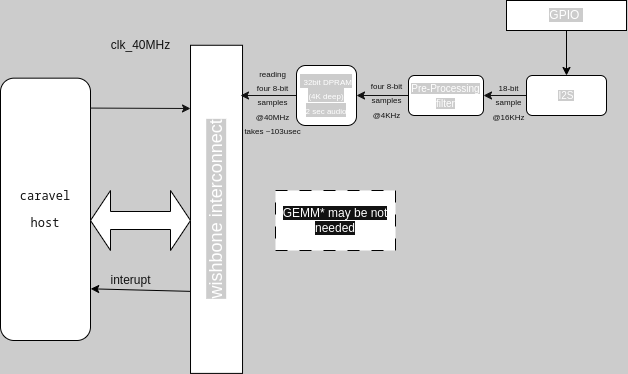

# GenAi

The project intent is to use Hyperdimensional vectors to represent and detect wake words. 

This decomposes the problem of detection to simple implementations of logical AND,logical XOR and permutation.

This the idea is to use chatgpt or likes of it to do most work!! So even if some code could be better or manually written
the intention is to keep manual coding minimalistic and see the limits of chatgpt for design.

The first intention was to try to do a novel algorithm instead of the proven NN approach. But, given the time limit and available
personal time I rather have something that is atleast working in simulation that explore the research aspect. May be I would come back at it someday!! 

After a breif study (3 days) I changed the design solution to be based on the following points:
choose a open source wake word model that is simple to implement and might work on resource constrained device. 
after a study with chatgpt (q & a) and looking around on the web, the one of the simplest and efficient model for RaspberryPi like devices 
is the [openwakeword](https://github.com/dscripka/openWakeWord). Although there is an more efficient [microwakeword](https://github.com/kahrendt/microWakeWord) model, openwakeword model is more direct and perhaps need less customizations. 

The model architecture is simple: 

openWakeword models are composed of three separate components:

  * melspectrogram : a 32 dimensional log-mel features from the provided audio samples using the following parameters:
        * stft window size: 25ms
        * stft window step: 10ms
        * mel band limits: 60Hz - 3800Hz
        * mel frequency bins: 32

        This is implemented as a dataflow graph as in . Although mathematically, the steps involves many more multiplications (fft -> abs -> pow2 -> log -> mel filterbank multiplications).
        A 1975msec audio recording, i.e. here results in (198,32) log mel embedding that can be fed into the next model. 

  * feature embeddings model: This model is provided by Google as a TFHub module under an Apache-2.0 license. For Genai, there is a python model that still being developed (using chatgpt, see model directory). The embedding model is developed based on the [paper](A https://arxiv.org/pdf/2005.06720). The referenced model is available at [kaggle](https://www.kaggle.com/models/google/speech-embedding/tensorFlow1/speech-embedding). "The architecture results in the first embedding requiring 12400 samples (775ms or 76 feature vectors). Each subsequent embedding vector requires a further 1280 samples (80ms or 8 feature vectors)". Thus resulting in expected embedding length = 16, when considering 1975msec audio recording, i.e. (198,32) input 

    Some of the details are not clearly understood but the initial model presented here closely matched to that being presented in the paper. The number of trainable parameters being 330K (329,929 to be exact). There could further tweaks to the model as the I get more time/roadblocks while developing. This is implemented as a dataflow graph as in . 

  * classification model: according the openWakeWord "The structure of this classification model is arbitrary, but in practice a simple fully-connected network or 2 layer RNN works well". For the time being, This part is already included in the feature embedding model. Ideally, this should have been something like .

The above steps gives an intuition of the computational complexity. We can roughly estimate the number of multiplications needed. See queried prompts to aid this analysis

| step   | calculation |  mults |  per time interval | input |output |
|----------|:-------------:|:------:|:------:|:------:|:------:|
| melspectrogram |  2×131,584×(round(n−257)/160​+1)+4,180,224+3n−1, n = 0.025*16000| 4708591 | 10ms |25 ms audio @ 16khz sampling rate |one 32-dimensional log-mel feature vector |
| embeddings model |    >= #trainable parameters   |   329929 | no calcs needed for first 775 ms,  then every 80ms upto 1975ms-775ms= 1200ms|76 log-mel feature vectors| one 96-dimensional embedded vector |
| keyword model | 128*1536 + (128*128) + 128 |    213120| no calcs needed for first 1975 ms, then every 80ms |16-embedded vector | 1 sigmoid output indicating yes/no|
|Total |                                        | 5251640 (~5.25M)  ||

Assume :
  - streaming mode i.e. continous audio, this means every 10ms, 5M multiplications have to be done. This is because when the last keyword model is run, there are no more melspectrogram windows to calculate. Of which the melspectrogram step needs max computations in shortest amount of time. Thus, making it to be an ideal candidate for acceleration.
  
  - user space clock frequency of 40 MHz. It might be ideal to choose a large matrix multiplier 256x256 to do the main melspectrogram fast enough. But given the space on silicon, such large design may not fit. I am yet to think over the micro architecture for this. 

After some good sleep, the GEMM module might be needed at all. I sonsider [INMP441](https://www.tinytronics.nl/index.php?route=product/product/get_file&file=3422/INMP441.pdf) as the sensor to be used. Representing 18 bit/ 24 bit audio samples at 16-bit should be feasible with some pre-processing/filtering. This can eventually be compressed into 8 bits samples, there by writing 4 samples into memory @ 4KHz. A 1975 milli second audio recording would there by take 4096 32-bit words in memory.

Assuming we can operate at atleast 40MHz, 1975ms audio recording in memory can be read by caraval subsystem in 103 usec.
  

  TO DO:
  - micro architecture
  - memory buffer requirements
  - dataflow
  - thorough performance estimates

