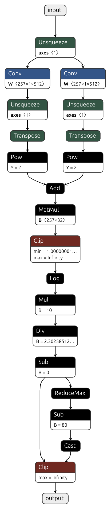

User

the model to compute melspectrogram is shown in onxx format as  in this picture. what is the input dimension? how can I interprete  the steps mathematically ?

ChatGPT

The ONNX diagram you've provided outlines a sequence of operations to compute a mel spectrogram from an input signal. Let's go through the operations and try to deduce the mathematical steps and the expected input dimensions:

    Input: The input dimension isn't specified in the diagram, but it will likely be a 1D tensor representing the raw audio signal.

    Unsqueeze: This operation adds a dimension to the tensor. If the input is a 1D tensor of shape (n,), it becomes a 2D tensor of shape (1, n) after this step.

    Conv: Two parallel convolution operations suggest that this could be implementing a filter bank, perhaps separating the input into different frequency bands. The convolution filters have a shape of (257, 1, 512), which indicates the input after unsqueeze is expected to be (1, n, 1) and will be expanded to (1, n, 512) after this step. This also implies that n must be sufficiently large to support convolution with a kernel of size 257 (likely the window size for STFT).

    Unsqueeze: Again, a dimension is added, making the tensor shape (1, 1, n, 512).

    Transpose: This swaps axes, but without specific parameters, it's hard to deduce the exact transformation. If it's a standard batch normalization, it might swap the last two dimensions.

    Pow: Squaring each element of the tensor, possibly representing the calculation of power from the magnitude of the frequency bins.

    Add: The sum of the two squared convolution results, which could be combining the outputs of a complex convolution representing real and imaginary parts.

    MatMul: A matrix multiplication with a (257, 32) matrix, which suggests transforming the 512 feature maps down to 32, potentially corresponding to the number of mel filters.

    Clip: Ensures values are above a minimum threshold, which might be used here to prevent taking the log of zero.

    Log: Computing the logarithm, which is a typical step in mel spectrogram computation to model human perception of sound.

    Mul, Div, Sub: A series of scaling and shifting operations, likely for normalization purposes.

    ReduceMax, Sub, Cast: Further normalization and type casting, perhaps to put the data in a form suitable for classification. The Sub operation with B=80 might be applying dynamic range compression.

    Clip: Another clipping step to ensure values are within a valid range, preventing any potential overflow or underflow in subsequent operations.

Mathematically, you could express the transformation from input to output as follows, where x is your input signal:

    X=Unsqueeze(x)X=Unsqueeze(x)
    Xconv1,Xconv2=Conv(X),Conv(X)Xconv1​,Xconv2​=Conv(X),Conv(X)
    Xpower=Pow(Xconv1)+Pow(Xconv2)Xpower​=Pow(Xconv1​)+Pow(Xconv2​)
    Xmel=MatMul(Log(Clip(Xpower,1,∞)),MelWeights)Xmel​=MatMul(Log(Clip(Xpower​,1,∞)),MelWeights)
    Xnorm=(Xmel×10)−02.30258512Xnorm​=2.30258512(Xmel​×10)−0​
    Xreduced=ReduceMax(Xnorm)Xreduced​=ReduceMax(Xnorm​)
    Xfinal=Clip(Cast(Xnorm−Xreduced−80),−∞,∞)Xfinal​=Clip(Cast(Xnorm​−Xreduced​−80),−∞,∞)

The final tensor represents the mel spectrogram. The sequence of operations after taking the logarithm seems to be a custom normalization scheme specific to the model requirements.

The input tensor's exact dimension (n) is not clear from the diagram, but it should be compatible with the first Conv operation, which expects a tensor where the second dimension is large enough to apply kernels of size 257. This implies that n must be at least 257, but more typically it would be larger to represent a window of audio data for the spectrogram computation.

User

ok, given the above requirement,  how many multiplications are involved
2 / 2

ChatGPT

To determine the number of multiplications involved in the computation, let's analyze each operation and count the multiplications:

    Conv: Two convolution operations with filters of size (257, 1, 512). Assuming the input tensor has dimensions (1, n, 512), where n >= 257, each convolution operation involves:
        Number of multiplications per filter application: 257×512=131,584257×512=131,584
        Number of filter applications (assuming stride of 1 and no padding): n−257+1=n−256n−257+1=n−256

    Total multiplications for two convolution operations: 2×131,584×(n−256)2×131,584×(n−256)

    MatMul: Matrix multiplication with a weight matrix of size (257, 32). Assuming the input tensor has dimensions (1, n, 512) (after unsqueeze and convolution), the number of multiplications involved in this operation is:
        Number of multiplications per element: 257×512×32=4,180,224257×512×32=4,180,224

    Mul: Multiplication by scalar value 10. Assuming the resulting tensor from the previous operation has nn elements, the number of multiplications involved is nn.

    Sub: Subtraction by scalar value 80. Assuming the resulting tensor from the previous operation has nn elements, the number of multiplications involved is nn.

    ReduceMax: Finding the maximum value. Assuming the resulting tensor from the previous operation has nn elements, the number of multiplications involved is n−1n−1 (assuming a naive reduction algorithm).

    Sub: Subtraction by scalar value 80. Assuming the resulting tensor from the previous operation has nn elements, the number of multiplications involved is nn.

In summary, the total number of multiplications involved in the computation is:

2×131,584×(n−256)+4,180,224+3n−12×131,584×(n−256)+4,180,224+3n−1

This expression gives the total number of multiplications for a given input size nn.

User

assume the stride length of 160 for conv layers

ChatGPT

If the stride length for the convolutional layers is 160, it means that the convolutional operation will skip 160 elements (samples) at a time along the input signal.

Let's adjust the calculations for the number of multiplications accordingly:

    Conv: The number of filter applications will depend on the stride length. Assuming a stride length of 160, the number of filter applications will be reduced to n−257160+1160n−257​+1.
        Number of multiplications per filter application: 257×512=131,584257×512=131,584

    Total multiplications for two convolution operations: 2×131,584×(n−257160+1)2×131,584×(160n−257​+1)

    MatMul: This operation remains unaffected by the stride length.
        Number of multiplications per element: 257×512×32=4,180,224257×512×32=4,180,224

    Mul: This operation is unaffected by the input size.

    Sub: This operation is unaffected by the input size.

    ReduceMax: This operation is unaffected by the input size.

    Sub: This operation is unaffected by the input size.

In summary, the total number of multiplications involved in the computation, considering a stride length of 160 for the convolutional layers, is:

2×131,584×(n−257160+1)+4,180,224+3n−12×131,584×(160n−257​+1)+4,180,224+3n−1

This expression gives the total number of multiplications for a given input size nn with a stride length of 160 for the convolutional layers.

User

consider  n = 0.025*16000
2 / 2

ChatGPT

Given n=0.025×16000n=0.025×16000, which refers to the number of samples in a 25 ms window sampled at 16 kHz. This calculation results in:

n=0.025×16000=400 samplesn=0.025×16000=400 samples

Using this nn value, let's calculate the number of multiplications involved in the operations specified previously:

    Convolution Layers:
    Number of filter applications=(400−257160+1)Number of filter applications=(160400−257​+1)
    Number of filter applications=(143160+1)≈1+0.89375≈2 (rounding up)Number of filter applications=(160143​+1)≈1+0.89375≈2 (rounding up)
        Multiplications per filter application: 257×512257×512
        Total multiplications for two convolution operations:
        2×131,584×2=527,1682×131,584×2=527,168

    MatMul:
        Multiplications:
        257×512×32=4,180,224257×512×32=4,180,224

    Mul, Sub, ReduceMax, Sub:
        Multiplications for these operations, but they are minimal in the context of total computation and typically nn related calculations are not the major contributor in operations like max and subtraction.

Thus, adding the contributions:
527,168 (from Conv)+4,180,224 (from MatMul)+3×400−1 (from remaining operations)527,168 (from Conv)+4,180,224 (from MatMul)+3×400−1 (from remaining operations)

This results in:
527,168+4,180,224+1199−1=4,708,591 total multiplications approximately527,168+4,180,224+1199−1=4,708,591 total multiplications approximately

This estimate covers the multiplications required for processing a 25 ms audio window at 16 kHz, considering the ONNX model operations and the specified stride length for the convolution layers.