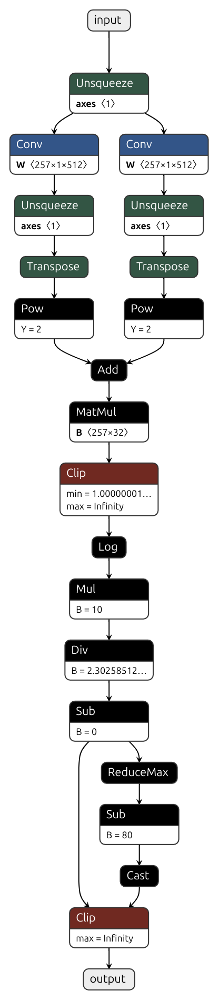

User

recal the first picture

ChatGPT

Let's revisit the breakdown and calculation of the number of multiplications from the operations described in the graph. Here are the details you need to focus on:
Convolutional Layers

Each convolution operation involves the multiplication of the input feature map by the filter (kernel) weights. The number of multiplications in a convolution operation depends on the dimensions of the input feature map, the dimensions of the filter, and the number of filters.

    Number of Convolution Layers: 2
    Filter size for each convolution layer: Assuming a kernel size of 257×1257×1
    Number of filters: 512

Given that both convolution layers appear to process the same size of input:

    Input size to each convolution: Let's assume it's 1×1×5121×1×512 based on the diagram (assuming the input has been expanded or is 1-dimensional).
    Convolution operation: Each element in the input feature map gets multiplied by each element in the kernel across all kernels.
        Multiplications per convolution operation: 257×1×512257×1×512 (as each of the 257 filter weights multiplies the input once for each of the 512 filters).

Matrix Multiplication (MatMul)

The MatMul operation involves multiplying two matrices.

    Matrix A size: This appears to be the result of the previous operations, likely 257×512257×512.
    Matrix B size: 257×32257×32.

    The number of multiplications for the MatMul would be based on matrix multiplication rules, which is 257×512×32257×512×32.

Power Operation (Pow)

Each Pow operation squares the result from each convolution layer, involving a multiplication for each element in the output of each convolution.

    Output size of each convolution (assuming single-dimensional output is expanded and transposed): 257×512257×512.
    Multiplications per Pow operation: Each of the 257×512257×512 elements is squared, hence 257×512257×512 multiplications per Pow layer, and since there are two Pow layers, it doubles.

Total Multiplications

Adding up all these calculations:

    Convolutions: 2×257×1×5122×257×1×512
    MatMul: 257×512×32257×512×32
    Pow operations (two layers): 2×257×5122×257×512

Let’s sum these up:

    Convolutions: 257×512×2257×512×2
    MatMul: 257×512×32257×512×32
    Pow operations: 257×512×2257×512×2

Total multiplications = 257×512×(2+32+2)257×512×(2+32+2)

Now, let's calculate the final total:

257×512×36=4,734,336257×512×36=4,734,336

This calculation assumes all layers process the entire input independently and are not reduced in dimension unless explicitly mentioned (like via pooling, which is not mentioned here). Note that these are theoretical computations and can vary based on actual implementation details such as strides, padding, and exact input sizes.